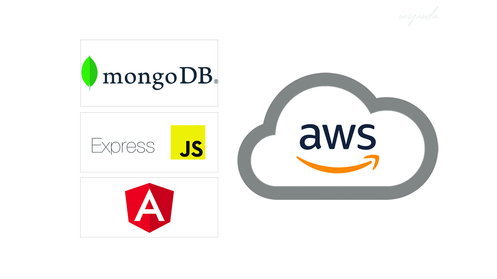

# MEAN-STACK-DEPLOYMENT-TO-UBUNTU-IN-AWS

This project explains how a MEAN stack can be implemented in AWS EC2. I will host  *** a simple Book Register web form *** web application on Ubuntu Server in AWS EC2.

---

> **M**ongoDB - is a document-based, No-SQL database used to store application data in a form of documents.

> **E**xpressJS - is a back end web application framework for Node.js, released as free and open-source software under the MIT License. It is designed for building web applications and APIs. It has been called the de facto standard server framework for Node.js.

> **A**ngular - is a TypeScript-based free and open-source web application framework led by the Angular Team at Google and by a community of individuals and corporations. Angular is a complete rewrite from the same team that built AngularJS.

> **N**odeJS - is an open-source, cross-platform, back-end JavaScript runtime environment that runs on the V8 engine and executes JavaScript code outside a web browser, which was designed to build scalable network applications..

<!-- *Implementation instructions* - [Click Here](https://github.com/oayanda/MERN-STACK-IMPLEMENTATION-ON-AWS/blob/main/project3.md) -->
